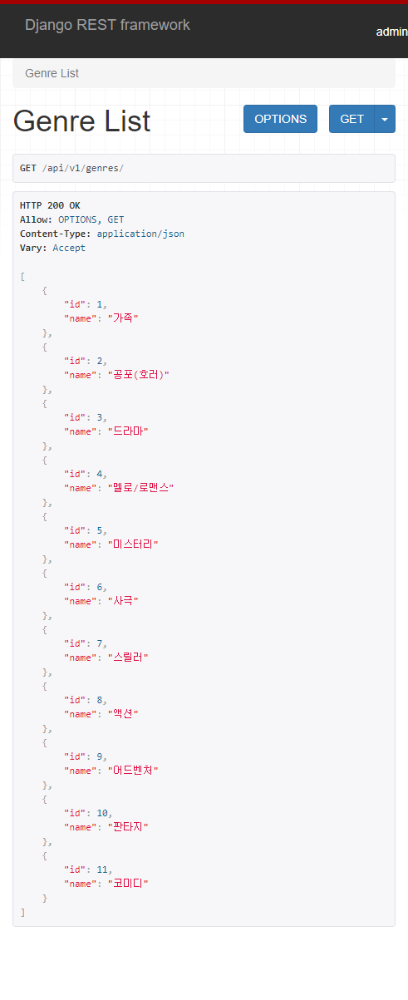
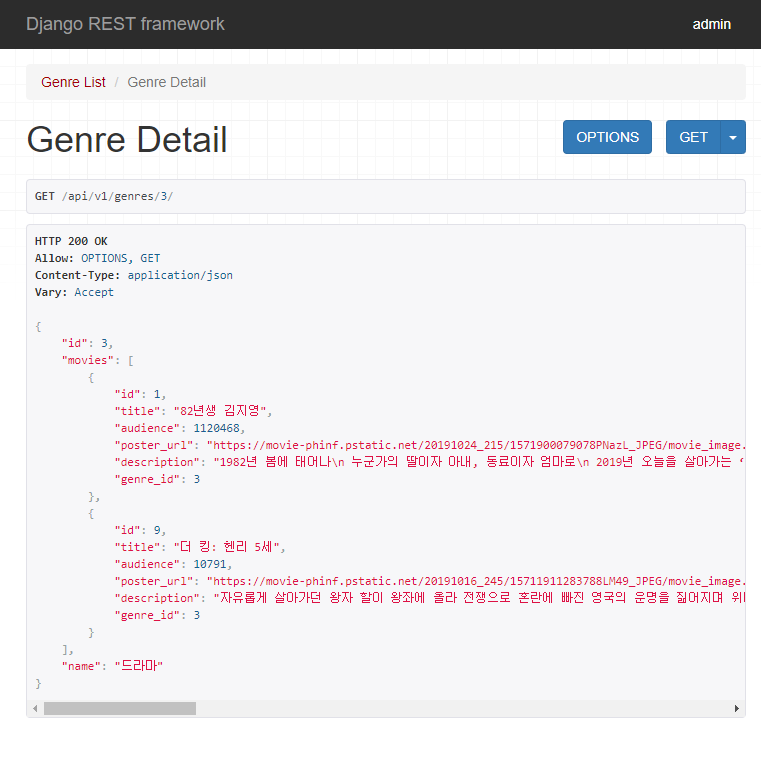

# README

### Import

#### views.py

```python
from django.shortcuts import render, get_object_or_404
from .models import Movie, Genre, Review
from rest_framework.decorators import api_view
from rest_framework.response import Response
from .serializers import MovieSerializer, ReviewSerializer, GenreSerializer, GenreDetailSerializer
```

#### serializers.py

```python
from rest_framework import serializers
from .models import Movie, Genre, Review
```

#### urls.py | movies

```python
from django.urls import path, include
from . import views

app_name = "movies"

urlpatterns = [
    path('genres/', views.genre_list, name="genre_list"),
    path('genres/<int:id>/', views.genre_detail, name="genre_detail"),
    path('movies/', views.movie_list, name="movie_list"),
    path('movies/<int:id>/', views.movie_detail, name="movie_detail"),
    path('movies/<int:id>/reviews/', views.review_create, name="review_create"),
    path('reviews/<int:id>/', views.review_detail, name="review_detail"),
]
```

#### urls.py | pjt08

```python
from django.contrib import admin
from django.urls import path, include
from drf_yasg.views import get_schema_view
from drf_yasg import openapi

schema_view = get_schema_view(
    openapi.Info(
        title="Movie_API",
        default_version='v1',
    )
)


urlpatterns = [
    path('admin/', admin.site.urls),
    path('api/v1/', include('movies.urls')),
    path('redoc/', schema_view.with_ui('redoc')),
    path('swagger/', schema_view.with_ui('swagger')),
]
```

#### INSTALLED_APPS

```python
INSTALLED_APPS = [
    'movies',
    'rest_framework',
    'drf_yasg',
    'django.contrib.admin',
    'django.contrib.auth',
    'django.contrib.contenttypes',
    'django.contrib.sessions',
    'django.contrib.messages',
    'django.contrib.staticfiles',
]
```


### 1. GET /api/v1/genres/



#### views.py

```python
@api_view(['GET'])
def genre_list(request):
    genres = Genre.objects.all()
    serializer = GenreSerializer(genres, many=True)
    return Response(serializer.data)
```

`api_view`로 get접근을 통해 genres에 있는 모든 데이터를 `serializer`의 형태로 보여준다.

#### serializers.py

```python
class MovieSerializer(serializers.ModelSerializer):
    class Meta:
        model = Movie
        fields = ('id', 'title', 'audience', 'poster_url', 'description', 'genre_id')
```



#### views.py

```python
@api_view(['GET'])
def genre_detail(request, id):
    genre = get_object_or_404(Genre, id=id)
    serializer = GenreDetailSerializer(genre)
    return Response(serializer.data)
```

#### serializers.py

```python
class GenreDetailSerializer(serializers.ModelSerializer):
    movies = MovieSerializer(source='movie_set', many=True)
    class Meta:
        model = Genre
        fields = ('id', 'movies', 'name')
```

같은 형태로 값을 넣어주지만 `serializers.py`에서 movies라는 값을 model인 Genre에 접근해서 1:M 관계인것을 활용하여 movie_set으로 접근 `many=True` 로 모든 항목을 가져와서 넘겨준다.


### 리뷰 작성

#### views.py

```python
@api_view(['POST'])
def review_create(request, id):
    serializer = ReviewSerializer(data=request.data)
    if serializer.is_valid(raise_exception = True):
        serializer.save(movie_id=id)
        return Response({'message': '작성되었습니다.'})
    return Response(serializer.data)


@api_view(['GET', 'PUT', 'DELETE'])
def review_detail(request, id):
    review = get_object_or_404(Review, id=id)
    if request.method == "GET":
        serializer = ReviewSerializer(review)
        return Response(serializer.data)
    elif request.method == "PUT":
        serializer = ReviewSerializer(data=request.data, instance=review)
        if serializer.is_valid(raise_exception = True):
            serializer.save()
            return Response({'message': '수정되었습니다.'})
    else:
        review.delete()
        return Response({'message': '삭제되었습니다.'})
```

`Modelfrom` 과 같은 형태로 `serializer`를 사용하는데 내부에 `request.POST` 대신에 `data=request.data` 를 넣어주고 `instance`는 수정할 때 똑같이 2번째 인자로 넣어준다. 그리고 유효한지 확인할 때 바로 에러를 발생 시킬 수 있도록 optional한 항목인 `serializer.is_valid(raise_exception = True)` 값을 준다.


.png)


### drf_yasg 사용법

`pip install -U drf-yasg` 로 설치

#### settings.py

```python
INSTALLED_APPS = [
   ...
   'drf_yasg',
   ...
]
```

#### urls.py

```python
...
from rest_framework import permissions
from drf_yasg.views import get_schema_view
from drf_yasg import openapi

...

schema_view = get_schema_view(
   openapi.Info(
      title="Snippets API",
      default_version='v1',
      description="Test description",
      terms_of_service="https://www.google.com/policies/terms/",
      contact=openapi.Contact(email="contact@snippets.local"),
      license=openapi.License(name="BSD License"),
   ),
   public=True,
   permission_classes=(permissions.AllowAny,),
)

urlpatterns = [
   url(r'^swagger(?P<format>\.json|\.yaml)$', schema_view.without_ui(cache_timeout=0), name='schema-json'),
   url(r'^swagger/$', schema_view.with_ui('swagger', cache_timeout=0), name='schema-swagger-ui'),
   url(r'^redoc/$', schema_view.with_ui('redoc', cache_timeout=0), name='schema-redoc'),
   ...
]
```

